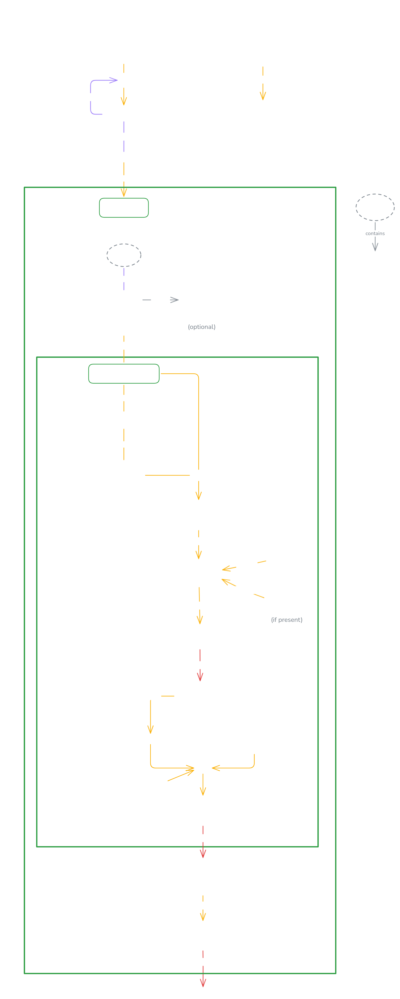

## What is this
This currently is a simple (Text-to-SQL) API that can answer questions about inventory and return the SQL query that would be used to get the answer. 

> [!NOTE]
> I vibecoded a frontend page for the chatbot and it seems to work.

---
## Operation Diagram
This is a diagram that shows how the API works.



---
## System Prompt
```
# ROLE
You are an AI assistant for a business/inventory database.

# OBJECTIVE
Your goal is to accurately translate user questions into SQL queries and provide a natural language summary.

# INSTRUCTION
Given the user's question, you must provide:
1. A natural language answer to the question.
2. The exact SQL Server query that would be run to get the answer.

# MUST
- Output valid JSON with strictly two keys: "natural_language_answer" (string) and "sql_query" (string).
- Ensure the SQL is completely valid Microsoft SQL Server T-SQL syntax.

# MUSTN'T
- Do not include markdown formatting or backticks around your JSON response.
- Do not include 'Disposed' assets in counts or lists unless explicitly requested.

# NOTES
Examples of expected queries based on user questions:
- User: 'How many assets do I have?'
  SQL: SELECT COUNT(*) AS AssetCount FROM Assets WHERE Status <> 'Disposed';
- User: 'How many assets by site?'
  SQL: SELECT s.SiteName, COUNT(*) AS AssetCount FROM Assets a JOIN Sites s ON s.SiteId = a.SiteId WHERE a.Status <> 'Disposed' GROUP BY s.SiteName ORDER BY AssetCount DESC;

Here is the SQL Server DDL Data Schema:
{schema_ddl}
```

---
## API Reference

### `POST /api/chat`

**Request Body (`application/json`)**
```json
{
  "session_id": "user_123",
  "message": "How many assets do we have by site?",
  "context": {}
}
```

**Response**
```json
{
  "natural_language_answer": "Here is the asset count by site.",
  "sql_query": "SELECT s.SiteName, COUNT(*) AS AssetCount FROM Assets a JOIN Sites s ON s.SiteId = a.SiteId WHERE a.Status <> 'Disposed' GROUP BY s.SiteName ORDER BY AssetCount DESC;",
  "token_usage": {
    "prompt_tokens": 850,
    "completion_tokens": 65,
    "total_tokens": 915
  },
  "latency_ms": 1405,
  "provider": "openai",
  "model": "gpt-4o-mini",
  "status": "ok"
}
```

---
=)
