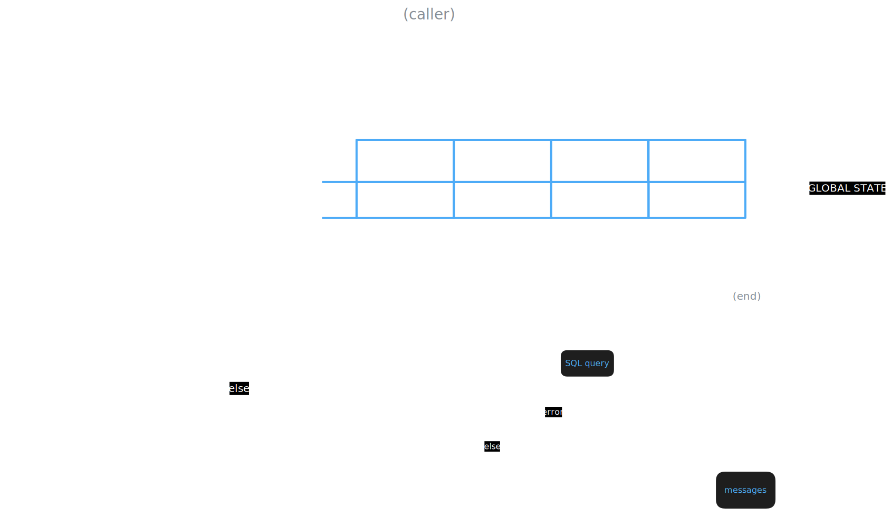
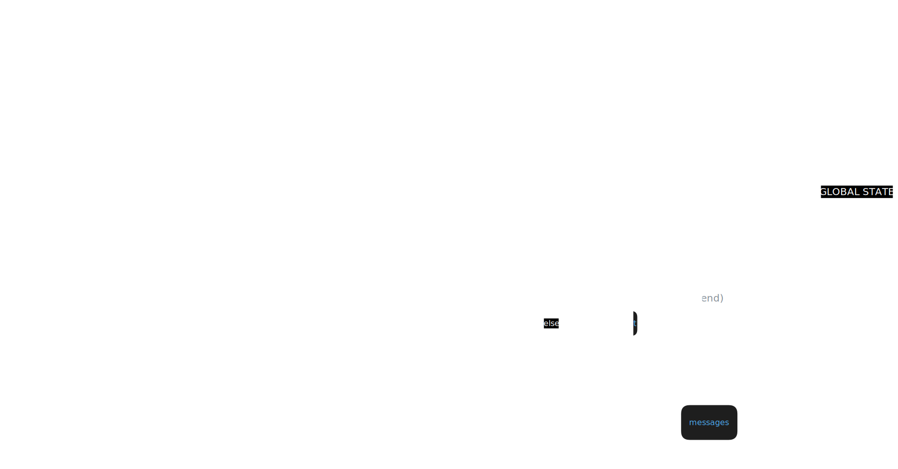

## What is This
This project contains two AI-powered chatbot agents:

### 1. SQL Agent (Inventory Chatbot)
An inventory chatbot that translates natural language questions into executable SQL queries against a SQLite database. It can accurately answer operational questions about assets, vendors, stock, and much more.

### 2. Neo4j Agent (Knowledge Graph Chatbot) 
An interactive knowledge graph agent that translates natural language into Cypher queries for Neo4j. It supports full CRUD operations:
- **Add**: Store new facts and relationships ("Remember that John works at Microsoft")
- **Inquire**: Search for information ("Who works at Microsoft?")
- **Update**: Modify existing facts ("Change John's company to Google")
- **Delete**: Remove information ("Forget about John")

Both agents maintain conversation history and include intelligent error correction.

---
## Operation Diagrams

### SQL Agent Architecture
Below is the system architecture showing how the LangGraph state machine routes intent, generates SQL, executes queries, and self-corrects errors.


### Neo4j Agent Architecture
The Neo4j agent follows a similar pattern but handles CRUD operations (Create, Read, Update, Delete) on a graph database:
- Classifies user intent into add/inquire/edit/delete/chitchat
- Generates appropriate Cypher queries
- Executes against Neo4j database
- Self-corrects errors with context-aware retry logic
- Maintains conversation history across sessions


---
## Dependency Requirements
This project requires Python 3.9+ and uses several external libraries. All dependencies are locked in the requirements.txt file.

Key dependencies include:
- langchain & langchain-openai
- langgraph
- python-dotenv
- sqlite3 (Built into Python)
- neo4j (Python driver for Neo4j database)

## Setup Instructions

### 1. Set Environment Variables
This project requires an OpenAI API key and database credentials.

1. Create a file named `.env` in the root directory of the project.

2. Add your credentials like this:

```env
# OpenAI Configuration
PROVIDER=openai
MODEL_API_KEY=your_openai_api_key_here
MODEL_NAME=gpt-4o-mini

# Neo4j Configuration (for Knowledge Graph Agent)
NEO4J_URI=neo4j+s://your-instance.databases.neo4j.io
NEO4J_USERNAME=your_username
NEO4J_PASSWORD=your_password
```

**For Neo4j Aura (Cloud):**
- Sign up at [neo4j.com/aura](https://neo4j.com/cloud/aura/)
- Create a free instance
- Copy the connection URI, username, and password to your `.env` file

### 2. Install Dependencies
Open your terminal, navigate to the project folder, and run:

```py
pip install -r requirements.txt
```
### 3. Initialize Databases

#### For SQL Agent (Inventory Chatbot):
Before running the SQL bot, you must provide your SQLite database.
Replace the `inventory_chatbot.db` file with your own database, or run the setup script:
```bash
python setup_database.py
```

#### For Neo4j Agent (Knowledge Graph):
The Neo4j agent will automatically create nodes and relationships as you add information. No initial setup required - just ensure your Neo4j instance is running and credentials are in `.env`.

---
## Running the Bots/Apps

### Run the SQL Agent (Inventory Chatbot)
To run the inventory chatbot against your SQLite database:
```bash
python main_sql.py
```

### Run the Neo4j Agent (Knowledge Graph Chatbot)
To run the knowledge graph chatbot:
```bash
python main_neo4j.py
```

### Example Interactions

**SQL Agent:**
```
You: How many items are in stock?
Bot: There are 150 items currently in stock.
```

**Neo4j Agent:**
```
You: Remember that Alice works at Google
Bot: Got it! I've stored that information.

You: Who works at Google?
Bot: Alice works at Google.

You: Update Alice's company to Microsoft
Bot: Updated successfully!
```
---
built by Asser =)

