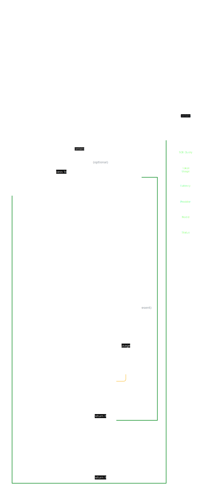

## What is this
This currently is a simple (Text-to-SQL) API that can answer questions about inventory and return the SQL query that would be used to get the answer. 

> [!NOTE]
> I vibecoded a frontend page for the chatbot and it seems to work.

---
## Operation Diagram
This is a diagram that shows how the API works.



---
## API Reference

### `POST /api/chat`

**Request Body (`application/json`)**
```json
{
  "session_id": "user_123",
  "message": "How many assets do we have by site?",
  "context": {}
}
```

**Response**
```json
{
  "natural_language_answer": "Here is the asset count by site.",
  "sql_query": "SELECT s.SiteName, COUNT(*) AS AssetCount FROM Assets a JOIN Sites s ON s.SiteId = a.SiteId WHERE a.Status <> 'Disposed' GROUP BY s.SiteName ORDER BY AssetCount DESC;",
  "token_usage": {
    "prompt_tokens": 850,
    "completion_tokens": 65,
    "total_tokens": 915
  },
  "latency_ms": 1405,
  "provider": "openai",
  "model": "gpt-4o-mini",
  "status": "ok"
}
```

---
=)
